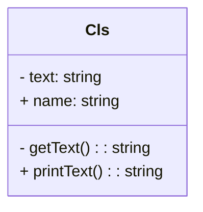
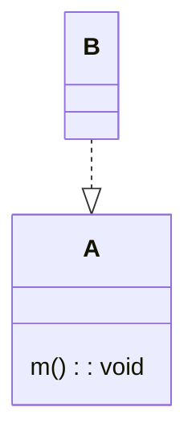
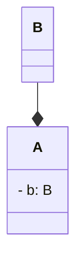
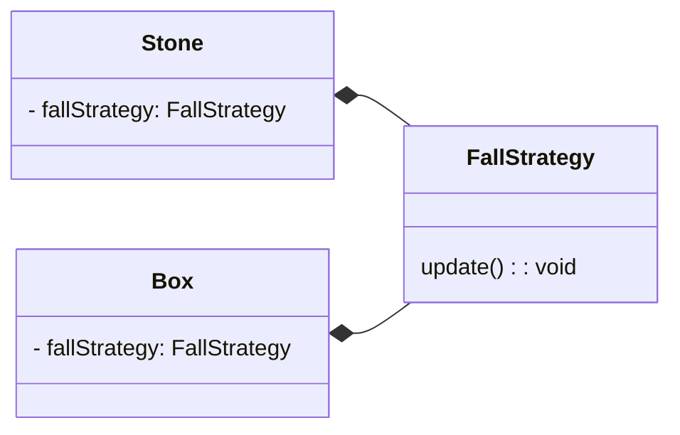
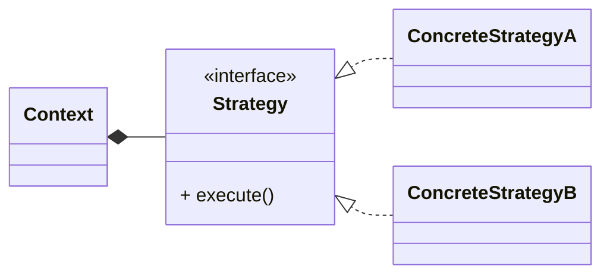

# 5. 유사한 코드 융합하기 
## Introduction
- 유사 클래스 통합 
- 조건부 산술로 구조 노출 
- UML 클래스 다이어그램 이해 
- 유사 코드 통합을 위한 전략 패턴의 도입
- 구현체가 하나뿐인 인터페이스를 만들지 말 것 

## 5.1 유사한 클래스 통합하기 
- `Stone`과 `FallingStone`으로 나눠져 있던 클래스를 `falling`이라는 상태 필드를 이용하여 구분하는 방법으로 변경 
  - `isFalling()`말고는 전부 유사해서 변경할 수 있었음
- boolean 상태 필드를 enum으로 변경하고, 클래스로 코드 이관을 적용하여 결국은 `falling`이라는 상태가 클래스로 표현됨 
  - Q. `FallingState`라는 상태를 나타내는 클래스가 `moveHorizontal()`이라는 메서드를 구현하고 있다. 왠지 "FallingState에 따라 돌이 다르게 움직인다."라고 생각했을 때, Tile의 상태가 변경되는 것이니 moveHorizontal()은 Tile이 구현하는게 더 자연스럽지 않나? 어색하다고 느껴지는 이유가 메서드 이름 때문일까? 아니면 행위가 어색한 객체에 있기 때문일까?   

```java
// as-is
class Stone implements Tile {}
class FallingStone implements Tile {}

// 1. 통합 
class Stone implements Tile {
  private final boolean falling;

  public Stone(boolean falling) {
    this.falling = falling;
  }

  void moveHorizontal() {/*구현*/}
}

// 2. enum으로 타입을 나타내고 
enum FallingState {
  FALLING, RESTING,
}

class Stone implements Tile {
  private final FallingState falling;

  public Stone(FallingState falling) {
    this.falling = falling;
  }
  
  void moveHorizontal() {/*구현*/}
}

// 3. 클래스로 타입 코드 대체 적용 
interface FallingState {
  void moveHorizontal();
}

class Falling implements FallingState {
  void moveHorizontal() {/*아무것도 안함*/}
}

class Resting implements FallingState {
  void moveHorizontal() {/*구현*/}
}

class Stone implements Tile {
  private final FallingState falling;

  public Stone(FallingState falling) {
    this.falling = falling;
  }

  void moveHorizontal() {
    falling.moveHorizontal();
  }
}
```

### 5.1.1 리팩터링 패턴: 유사 클래스 통합
- 일련의 상수 메서드를 공통으로 가진 두 개 이상의 클래스에서, 일련의 상수 메서드가 클래스에 따라 다른 값을 반환할 때 적용하여 클래스를 통합할 수 있음 
  - 일련의 상수 메서드 = 기준(basis)


## 5.2 단순한 조건 통합하기 
### 5.2.1 리팩터링 패턴: if문 결합
- 내용이 동일한 연속적인 `if`문을 결합하여 중복을 제거 
  - `||`을 추가해서 두 식의 관계를 드러냄 
  - `IntelliJ`는 결합할 수 있는 `if`문을 자동으로 결합 해준다 

```java
class ThisIsClass {
  void asIs() {
    if (expression1) {
      /* 본문 */
    } else if (expression2) {
      /* 동일한 본문 */
    }
  }
  
  void toBe() {
    if (expression1 || expression2) {
      /* 본문 */
    }
  }
}
```


## 5.3 복잡한 조건 통합하기 
- 물리적으로는 다르게 구현되었으나 논리적으로 같은 로직을 완전히 동일하게 변경 -> `if`문 결합 

```java
class ThisIsClass {
  // map[y][x] 는 Stone 혹은 Box이다.
  // map[y + 1][x] 는 Air다.
  void asIs() {
    if (expression1) {
      map[y + 1][x] = new Stone(new Falling());  // map[y + 1][x]를 Falling 상태의 Stone으로 변경 
      map[y][x] = new Air();  // map[y][x]를 Air로 변경 
    } else if (expression2) {
      map[y + 1][x] = new Box(new Falling());  // map[y + 1][x]를 Falling 상태의 Box로 변경
      map[y][x] = new Air();  // map[y][x]를 Air로 변경
    }
  }
  
  // asIs에서, Stone과 Box에 상태를 Falling으로 변경하는 공통 메서드가 있다면 아래와 같이 통일할 수 있다.
  // map[y][x] 는 Stone 혹은 Box이다.
  // map[y + 1][x] 는 Air다.
  void toBe() {
    if (expression1 || expression2) {
      map[y][x].drop();  // Stone 혹은 Box의 상태를 Falling으로 변경한다.
      map[y + 1][x] = map[y][x]; // 상태가 변경된 Stone 혹은 Box를 Air의 자리에 넣는다. 
      map[y][x] = new Air();  // Stone 혹은 Box가 있던 자리를 Air로 채운다.  
    }
  }
}
```

### 5.3.1 조건을 위한 산술 규칙 사용 
- 산술 규칙의 우선순위를 기억하자.
  - ex: and 연산이 or 연산보다 우선 적용된다.


### 5.3.2 규칙: 순수 조건 사용
- 조건은 순수 조건이어야 한다.
  - 순수(pure): 조건에 부수적인 동작이 없음 
  - 부수적인 동작: 변수에 값을 할당, 예외 발생, I/O...
- 결국, SRP(단일 책임 원칙)를 지키자는 의미로 해석됨
  - 메서드는 한 가지 작업을 수행해야 한다 

```java
class ThisIsClass {
  private String[] data;
  private int current;
  
  // 아래의 메서드는 두 가지 작업을 수행한다. 
  // - current를 증가시키는 작업 
  // - data[current]가 null인지를 판단하는 작업  
  // 이는 단일 책임 원칙을 위배한다고 생각할 수 있다. 
  boolean notPure() {
    current++;
    return data[current] || null;
  }

  // 아래와 같이 작성해서 한 가지 작업만 수행하게 하자!
  boolean pure() {
    return data[current] || null;
  }

  void increase() {
    current++;
  }
}
```

- 스멜
  - 명령에서 질의 분리 
    - 명령: 부작용이 있는 모든 것
    - 질의: 순수한 것 
  - 즉, 부수적인 동작을 하거나 무언가를 반환하는 것 중 하나만 수행하게 하자 (SRP)
- 목적
  - 데이터를 가져오는 것과 변경하는 것의 분리 
  - 간단한 메서드일수록 네이밍이 쉬워진다
    - 반대로, 네이밍이 어려운 메서드는 너무 많은 작업을 수행하고 있는게 아닌지 의심 해보자 


### 5.3.3 조건 산술 적용 
- `&&`에는 `*`를, `||`에는 `+`를 적용하여 생각 해보자

```text
expressionA && expressionB || expressionC && expressionB
 |--- a ---| * |--- b ---| + |--- c ---| * |--- b ---|
 
=> a*b + c*b = (a + c) * b

=> (expressionA || expressionC) && expressionB
```

- tip: 이름은 문맥도 포함해야 한다! 


## 5.4 클래스 간의 코드 통합 
### 5.4.1 UML 
- Unified Modeling Language
- 아키텍처나 일이 일어나는 순서와 같은 코드에 대한 속성을 표현하기 위해 사용하는 프레임워크
- 표현 방법 

- 구현 


- 컴포지션 


- 예제 다이어그램 


### 5.4.2 리팩터링 패턴: 전략 패턴의 도입 

- 상태 패턴 
  - 전략이 필드를 가지고 있는 경우
- 특징 
  - 클래스를 추가해서 변경이 가능하게 하는 것 
  - 전략 패턴에서는 기능을 변경해야 하는 경우, 메서드를 추가하기 보다 새로운 클래스를 추가함
  - 늦은 바인딩 (런타임 바인딩) 
- 전략 패턴을 도입하는 상황
  - 코드에 변형을 도입하고 싶어서 리팩터링을 수행하는 경우  
  - 클래스 간의 동작을 통합하려는 경우 

### 5.4.3 규칙: 구현체가 하나뿐인 인터페이스를 만들지 말 것 
- 오히려 가독성에 방해만됨 
  - Q. 만약 계층을 분리해야 할 경우(의존성 역전을 이용해서)에는 구현체가 하나여도 인터페이스를 두는게 좋을까?
- 추상화는 인지된 복잡성의 감소를 위해, 실제 복잡성의 증가를 허용하는 행위이다
  - 추상화는 신중하게 수행해야 한다는 뜻 
- Test 측면에서...
  - 인터페이스를 사용하면 테스트하기 쉽다는 장점이 있음
    - 하지만, 구현체가 하나뿐인 인터페이스를 사용하면 테스트하기 어려워짐
  - 그러니 인터페이스를 두어서 구현체를 적절히 갈아끼워 테스트하기 쉬운 코드를 만드는 것이 좋다
  - Mokito를 쓰면 되지 않느냐?
    - Mokito 라이브러리는 무겁다. 코드가 몇줄이 안될 때는 Mokito가 크게 영향을 주지 않지만, 프로덕트 코드는 몇천줄이 넘어간다. 이에 Mokito를 이용하게 되면 매우 느려진다고 함.


### 5.4.4 리팩터링 패턴: 구현에서 인터페이스 추출 
- 예제 참고 


## 5.5~5.6 유사 함수 통합하기 ~ 유사한 코드 통합하기  
- 유사한 코드를 가진 곳에 전략 패턴 & 인터페이스 추출 기법을 적용할 수 있음 
- 전략은 외부에서 주입받도록 변경 
- p.163 질문 
  - Lock에 사용되는 전략과 Key에 사용되는 전략이 서로 다르다 
  - 전략이 다름에도 불구하고, `KeyConfiguration`이라는 하나의 전략 클래스로 묶어버렸다
  - Lock에는 필요하지 않은 `removeStrategy`가 생기고, Key에는 필요하지 않은 `_1`이 생겨버린다 
  - 이렇게 필요하지 않은 것이 들어있는 것(?)은 고려하지 않아도 되는 부분인가? 당장 필요없는 것이 생겨버리는 것은 단지 Trade-off의 대상일 뿐인가? 


## 요약
- 모아야 할 코드가 있을 때 
  - 유사 클래스 통합, if문 결합, 전략 패턴의 도입 사용 
- 부수적인 동작과 조건은 서로 분리하자 
- 구현체가 하나뿐인 인터페이스는 불필요한 일반화의 한 형태이다 
  - 구현에서 인터페이스를 추출하는 방법을 이용하여 인터페이스를 나중에 도입하는 방안을 택하자 