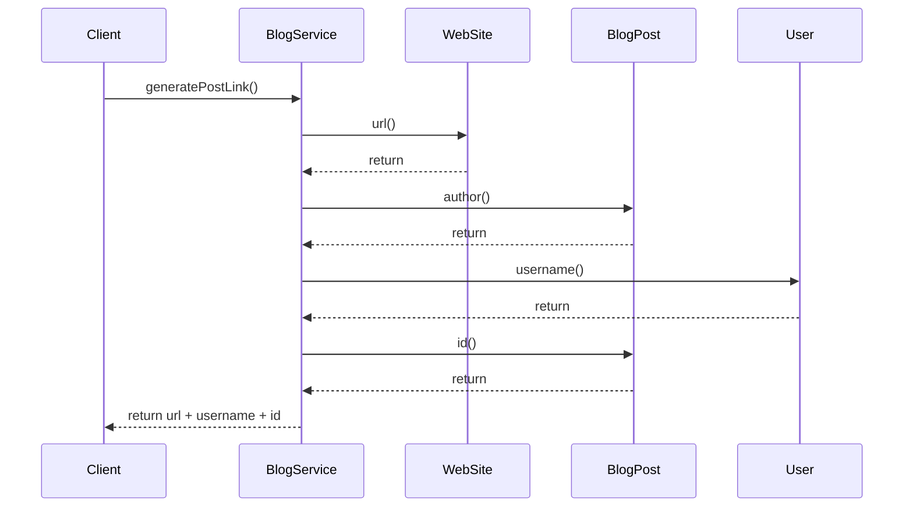
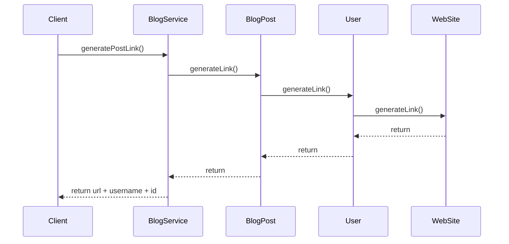

# 6. 데이터 보호 
- 해당 단원은 **캡슐화**에 초점

## 6.1 getter 없이 캡슐화 하기 
### 6.1.1 규칙: getter와 setter를 사용하지 말 것  
#### getter
- 캡슐화를 깨버리고, 객체의 불변속성을 전역적으로 만들어버림 -> 유지보수가 어려워짐

#### setter
- 내부 데이터 구조를 변경하는 메서드
- 객체의 불변성을 깨버림. 즉, setter가 있으면 가변 객체가 됨.

#### 풀 기반 아키텍처 
```java
public class PullArchitecture {
    record WebSite(String url) {
    }

    record User(String username) {
    }

    record BlogPost(User author, String id) {
    }

    static class BlogService {
        String generatePostLink(WebSite webSite, BlogPost blogPost) {
            String url = webSite.url();
            User author = blogPost.author();
            String username = author.username();
            String id = blogPost.id();

            return url + username + id;
        }
    }
}
```

- 데이터를 가져와서 중앙에서 연산을 수행하는 아키텍처
- 기능을 수행하는 메서드가 없음 
  - 수동적인 데이터 클래스 + 데이터를 혼합해서 모든 작업을 수행하는 소수의 관리자 클래스 형태로 구성됨 
  - ex: 도메인 객체에서 `getXxx()`로 모든 데이터를 꺼내와서 `XxxService`에서 모든 비즈니스 로직을 수행하는 형태
- 해당 아키텍처는 tight coupling을 유발한다 
  - ex: 도메인 객체의 변경이 `XxxService`에도 영향을 미치게 됨

#### 푸시 기반 아키텍처
```java
public class PushArchitecture {
    record WebSite(String url) {
        String generateLink(String username, String id) {
            return url + username + id;
        }
    }

    record User(String username) {
        String generateLink(WebSite website, String id) {
            return website.generateLink(username, id);
        }
    }

    record BlogPost(User author, String id) {
        String generateLink(WebSite webSite) {
            return author.generateLink(webSite, id);
        }
    }

    static class BlogService {
        String generatePostLink(WebSite webSite, BlogPost blogPost) {
            return blogPost.generateLink(webSite);
        }
    }
}
```


- 연산 작업을 데이터 가까이서 수행하는 아키텍처
- 데이터를 가져오는 대신, 파라미터로 데이터를 전달함

#### 스멜 
- **디미터 법칙**
  - Tell Don't Ask (묻지 말고 요청해라)
  - 낯선 사람에게 말하지 말라 


#### 의도
- `getXxx()`를 사용하여 데이터를 가져와서 연산을 수행하게 되면, 결합도가 높아진다. 
  - 이렇게 될 경우, 객체의 내부 구조에 대해 어느정도 알아야만 함 
  - 객체는 계속해서 `getXxx()`를 지원하지 않는 한 데이터 구조를 변경할 수 없게 됨
- 푸시 기반 아키텍처를 사용하여, 사용자가 메서드의 내부 구조에 대해 신경쓰지 않게 하자 