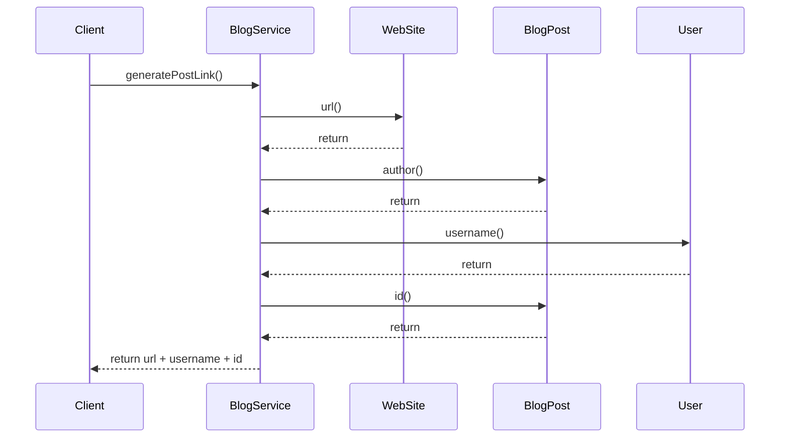
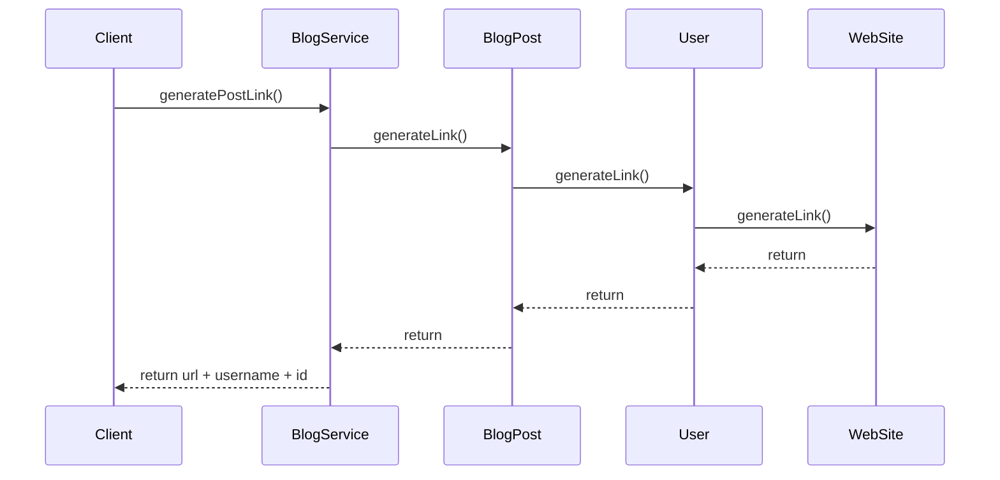

# 6. 데이터 보호 
- 해당 단원은 **캡슐화**에 초점

## 6.1 getter 없이 캡슐화 하기 
### 6.1.1 규칙: getter와 setter를 사용하지 말 것  
#### getter
- 캡슐화를 깨버리고, 객체의 불변속성을 전역적으로 만들어버림 -> 유지보수가 어려워짐

#### setter
- 내부 데이터 구조를 변경하는 메서드
- 객체의 불변성을 깨버림. 즉, setter가 있으면 가변 객체가 됨.

#### 풀 기반 아키텍처 
```java
public class PullArchitecture {
    record WebSite(String url) {
    }

    record User(String username) {
    }

    record BlogPost(User author, String id) {
    }

    static class BlogService {
        String generatePostLink(WebSite webSite, BlogPost blogPost) {
            String url = webSite.url();
            User author = blogPost.author();
            String username = author.username();
            String id = blogPost.id();

            return url + username + id;
        }
    }
}
```

- 데이터를 가져와서 중앙에서 연산을 수행하는 아키텍처
- 기능을 수행하는 메서드가 없음 
  - 수동적인 데이터 클래스 + 데이터를 혼합해서 모든 작업을 수행하는 소수의 관리자 클래스 형태로 구성됨 
  - ex: 도메인 객체에서 `getXxx()`로 모든 데이터를 꺼내와서 `XxxService`에서 모든 비즈니스 로직을 수행하는 형태
- 해당 아키텍처는 tight coupling을 유발한다 
  - ex: 도메인 객체의 변경이 `XxxService`에도 영향을 미치게 됨

#### 푸시 기반 아키텍처
```java
public class PushArchitecture {
    record WebSite(String url) {
        String generateLink(String username, String id) {
            return url + username + id;
        }
    }

    record User(String username) {
        String generateLink(WebSite website, String id) {
            return website.generateLink(username, id);
        }
    }

    record BlogPost(User author, String id) {
        String generateLink(WebSite webSite) {
            return author.generateLink(webSite, id);
        }
    }

    static class BlogService {
        String generatePostLink(WebSite webSite, BlogPost blogPost) {
            return blogPost.generateLink(webSite);
        }
    }
}
```


- 연산 작업을 데이터 가까이서 수행하는 아키텍처
- 데이터를 가져오는 대신, 파라미터로 데이터를 전달함

#### 스멜 
- **디미터 법칙**
  - Tell Don't Ask (묻지 말고 요청해라)
  - 낯선 사람에게 말하지 말라 


#### 의도
- `getXxx()`를 사용하여 데이터를 가져와서 연산을 수행하게 되면, 결합도가 높아진다. 
  - 이렇게 될 경우, 객체의 내부 구조에 대해 어느정도 알아야만 함 
  - 객체는 계속해서 `getXxx()`를 지원하지 않는 한 데이터 구조를 변경할 수 없게 됨
- 푸시 기반 아키텍처를 사용하여, 사용자가 메서드의 내부 구조에 대해 신경쓰지 않게 하자 


### 6.1.3 리팩터링 패턴: getter와 setter 제거하기 
#### 예제 
```java
// As-is
class Market {
    private final Product product;
    
    public Market(Product product) {
        this.product = product;
    }
    
    void increaseStock(int value) {
        int increasedValue = product.getStock() + value;  // 꺼내서, 처리 후  
        product.setStock(increasedValue);  // 데이터를 세팅 
    }
}

class Product {
    private int stock;
    
    public int getStock() {
        return stock;
    }
    
    public void setStock(int stock) {
        this.stock = stock;
    }
}

// To-be
class Market {
    private final Product product;
    
    public Market(Product product) {
        this.product = product;
    }
    
    void increaseStock(int value) {
        product.increaseStock(value);  // 값을 꺼내지 않고, 데이터를 전달
    }
}

class Product {
    private int stock;
    
    void increaseStock(int value) {
        stock += value;  // 데이터에 가까운 쪽에서 처리 
    }
}
```
- 결국, 데이터를 들고있는 객체에게 업무를 부탁하는 것이 된다. 메세지 전달..? 
  - 꺼내서 처리하는게 아닌, 처리 부탁!
  - ex: 드럼님의 파워를 꺼내서 딱구를 해당하는 파워만큼 접는다 (x) | 드럼님에게 딱구를 접어달라고 한다 (o)
    - 이걸 코드로 표현하면...
    ```java
    public static void main(String[] args){
        // Bad case
        Drum drum = new Drum();
        int power = drum.getPower();
        
        Ddakgu ddakgu = new DdakGu();
        fold(ddakgu, power);
    
        // Good case
        drum.fold(ddakgu);
    }
    ```

---

---

## 6.2 간단한 데이터 캡슐화하기 
### 6.2.1 규칙: 공통 접사를 사용하지 말 것
- 코드에는 공통 접두사나 접미사가 있는 메서드나 변수가 없어야 함 
  - ex: `username`, `startTimer`...

```java
// As-is
class SomeClass {
    private String username;

    void startTimer() {
        // ...
    }
}

// To-be
class User {
    private String name;
}

class Timer {
    void start() {
    }
}
```

- 단일 책임 원칙
    - **클래스에는 단 하나의 책임만 있어야 한다**
      - "메서드는 한 가지 작업만 해야한다"와 비슷한 규칙


- 공통 접사가 암시하는 구조
  - 해당 메서드와 변수가 공통 접사의 책임을 공유한다는 것을 의미 
  - 공통 접사를 사용하는 경우, 공통 책임을 전담하는 별도의 클래스가 있어야 하고, 해당 클래스에 변수나 메서드를 이동시켜야 함


- 결론적으로, 각 변수나 각 메서드를 갖고 있을 **올바른 객체를 찾는 과정**으로 이해하였음 
  - ex: `username`이라는 변수 -> `User`라는 클래스에 `name`이라는 필드 변수로 설정 -> `username`이라는 변수는 `User`가 갖고 있는게 자연스러움 
    - 조금 표현이 웃기긴 한데.. username이라는 값을 가지고 있어야 할 책임(?이라고 표현하는게 맞나..)은 `User`에게 있음 
  - ex: `startTimer()`라는 메서드 -> `Timer`라는 클래스를 만들고 `start()`라는 메서드를 생성 -> `start()`라는 메서드는 `Timer`가 갖고 있는게 자연스러움
    - start()라는 메서드를 가지고 있어야 할 책임은 `Timer`에게 있음. 즉, 타이머를 시작할 책임을 `Timer`라는 객체에게 부여.


- 데이터 캡슐화
  - 변수와 메서드를 클래스로 옮기는 과정 


### 6.2.3 리팩터링 패턴: 데이터 캡슐화 
- 변수화 메서드를 캡슐화 하면, 접근할 수 있는 지점을 제한하고 구조를 명확하게 만들 수 있음 
  - 응집도↑ 결합도↓


- 데이터를 캡슐화 하면...
  - 데이터에 대한 어떠한 전제가 있을 수 있음 (ex: 돈은 음수가 될 수 없다)
  - 데이터가 여러 군데 퍼져있으면, 전제가 변경될 경우 여러 군데를 수정해야 함 -> 이는 유지보수성이 떨어지는 결과를 초래 
  - 데이터를 캡슐화하면, 데이터가 존재하는 범위를 제한할 수 있게되고, 결론적으로 클래스 내의 메서드만 데이터를 수정할 수 있으므로 유지보수성이 상승하는 결과를 초래
  - 즉, 변경사항이 발생했을 때, 변경이 영향을 미치는 범위가 최소화되는 구조를 만들어야 한다.

```java
// As-is : 총 두 군데를 변경해야 한다 
class SomeClass1 {
    void someMethod(String email) {
        validate(email);  // email에 대한 정책이 변경될 경우 변경해야 할 부분
        // ... 
    }
}

class SomeClass2 {
    void someMethod(String email) {
        validate(email);  // email에 대한 정책이 변경될 경우 변경해야 할 부분
        // ... 
    }
}

// To-be : 한 군데만 변경해도 된다 (As-is에 비해 변경 포인트가 감소하였다. 예제에서는 한 군데만 감소했지만, 사용하는 클래스가 수없이 늘어난다면..?)
class Email {
    private final String email;

    public Email(String email) {
        validate(email);  // email에 대한 정책이 변경될 경우 변경해야 할 부분
        this.email = email;
    }
}

class SomeClass1 {
    void someMethod(String email) {
        Email email = new Email(email);  // 사용하는 측에서는 email에 대해 검증하지 않아도 된다
        // ...
    }
}

class SomeClass2 {
    void someMethod(String email) {
        Email email = new Email(email);
        // ... 
    }
}
```

- 메서드를 수행할 적절한 객체를 찾자
- 데이터를 가지고 있는 쪽에서 메서드를 수행하자 
- `getXxx()`로 꺼내서 일을 시키지 말고, 그냥 일을 시키자 ... `TDA`
- 전체적으로 어떤 코드가 수행되는지 알기가 쉬워진다.
  - 의미 있는 메서드가 작성된다.
  - 명확한 메서드가 작성된다.

---

---

## 6.4 순서에 존재하는 불변속성 제거하기 
- 무언가가 다른 것보다 먼저 호출되어야 할 때, **순서 불변속성(sequence invariant)** 이라고 함 
  - 생성자를 먼저 호출하지 않는 것은 불가능 -> 생성자에 무언가를 위임한다는 것은 순서 불변속성이 제거되는거나 다름 없음 
  - ex: a() 호출 후 b()를 호출해야 함 -> a()로직을 생성자로 이관 (무조건 이관하는것은 안됨. 초기화 관련 코드를 이관해야 함.) -> b()는 순서 불변속성 없이 호출되어도 무관!


### 6.4.1 리팩터링 패턴: 순서 강제화 
- 