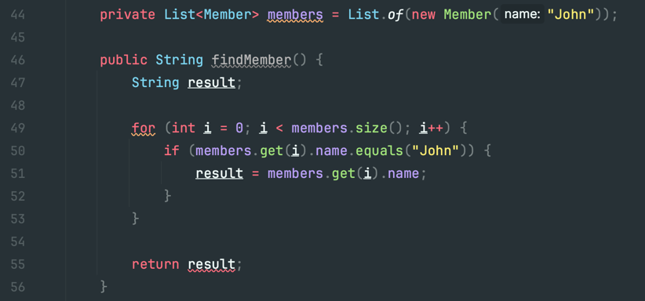
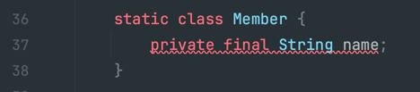
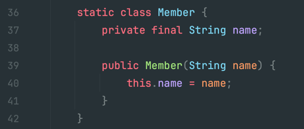
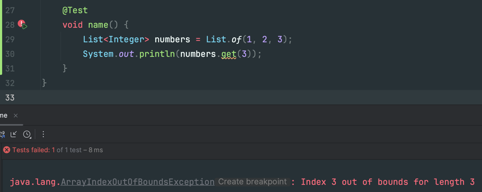

# 7. 컴파일러와의 협업
## 7.1 컴파일러에 대해 알아보기
### 7.1.1 약점: 정지 문제는 컴파일 시 알 수 있는 것을 제한함
- [정지 문제(Halting Problem)](https://ko.wikipedia.org/wiki/%EC%A0%95%EC%A7%80_%EB%AC%B8%EC%A0%9C)
    - "주어진 프로그램이 해결하고자 하는 문제"가 "해결이 가능한지"를 "판단할 수 있는 일반화된 알고리즘"이 존재하는가?
        - ex: 어떤 프로그램이 멈출지, 또는 영원히 계산할지(무한루프)를 판단할 수 있는 알고리즘이 있는가?
    - 컴파일러는 "런타임 동안 어떤 일이 발생하는지를 판단해줄 수 있는 일반화된 알고리즘이" 없음
- 즉, "프로그램은 근본적으로 예측이 불가능하다"

#### 예제
```typescript
if (new Date().getDay() === 35) {  // 이는 무조건 false이다. 해당 if문을 통과할 일은 없다. 
  5.
  foo();  // 해당 메서드는 절대 실행될리 없다. 하지만, 컴파일러는 이게 실행 가능성이 있는지를 판단하는 알고리즘이 없어 컴파일 에러를 뱉는다. 
}
```
- 위와 같이, 컴파일러가 프로그램이 안전하다고 보장할 수 없는 경우, 컴파일러는 컴파일 에러를 뱉어낸다.
    - 이를 책에서는 "보수적 분석(conservative analysis)"라고 표현하였다.


### 7.1.2 장점: 도달성 검증은 메서드의 반환을 보장함
- 도달성 검증
    - 메서드가 모든 경우에 대해 `return`되는지 확인

#### 예제
```java
public class CompilerTest {
    enum Color {
        RED, GREEN, BLUE,
    }

    // 컴파일 에러 발생 
    String returnColorCode(Color color) {
        if (color == Color.RED) {
            return "#ff0000";
        }

        if (color == Color.GREEN) {
            return "#00ff00";
        }

        if (color == Color.BLUE) {
            return "#0000ff";
        }

        // 아무것도 아닌 경우에 대해서도 return이 있어야 함
    }

    // 컴파일 에러 미발생 (모든 케이스에 대해 처리됨)
    String returnColorCode(Color color) {
        if (color == Color.RED) {
            return "#ff0000";
        }

        if (color == Color.GREEN) {
            return "#00ff00";
        }

        if (color == Color.BLUE) {
            return "#0000ff";
        }

        throw new RuntimeException();  // 예외라도 던져야 함 
    }

    // 컴파일 에러 미발생 (모든 케이스에 대해 처리됨)
    String returnColorCode(Color color) {
        return switch (color) {
            case RED -> "#ff0000";
            case GREEN -> "#00ff00";
            default -> throw new RuntimeException();
        };
    }

    // 컴파일 에러 미발생 (모든 케이스에 대해 처리됨)
    String returnColorCode(Color color) {
        return switch (color) {
            case RED -> "#ff0000";
            case GREEN -> "#00ff00";
            case BLUE -> "#0000ff";
        };
    }
}
```


### 7.1.3 장점: 확정 할당은 초기화되지 않은 변수에 대한 접근을 막음 
- 컴파일러는 변수가 사용되기 전에 변수에 값이 확실히 할당되었는지 그 여부를 알아낼 수 있음

#### 예제1
```java
class CompilerTest {
    private List<Member> members = List.of(new Member("John"));

    public String findMember() {
        String result;

        for (int i = 0; i < members.size(); i++) {
            if (members.get(i).name.equals("John")) {  // 우리 입장에서는 이것이 반드시 실행됨을 알아도, 컴파일러는 판단할 수 없음 
                result = members.get(i).name;  // 즉, 컴파일러는 if문을 수행하지 않을 수도 있다고 판단하며, 이로 인해 result라는 변수가 초기화가 되지 않을 수도 있다고 생각함 
            }
        }

        return result;  // 컴파일 에러 발생 
    }
}
```

- 위 예제에서는 `String result = ""`와 같이 미리 초기화를 해둔 값을 이용하면 컴파일 에러가 사라짐 
  - 즉, 초기화가 완벽하게 보장되어야 함 

#### 예제2
- `java`에서는 `final` 키워드를 이용하여 변수를 확정적으로 할당해야 함을 컴파일러에게 알릴 수 있다. 


- `final` 키워드를 사용 → 확정적으로 초기화 해줘야 하는데, 저것만 보고는 확정적으로 초기화가 되지 않는다고 판단 → 컴파일 에러 발생 


- 생성자에서 초기화를 해주면, 확정적으로 초기화가 된다고 판단하여 컴파일 에러가 사라짐 


### 7.1.4 장점: 접근 제어로 데이터 캡슐화 지원 
- `private`, `package-private(default)`, `protected` 와 같은 접근 제어자를 이용하여 데이터 캡슐화를 지원
- 가시 범위를 벗어나는 경우, 컴파일러가 이를 캐치하고 컴파일 에러를 발생시켜줌 


### 7.1.5 장점: 타입 검사기는 속성을 보증함 (타입이 맞는지를 체크)
- "파라미터로 올바른 타입이 넘어왔는가?"를 알 수 있음 

#### 예제
```java
class CompilerTest {
    static void print(String name, String nickName, String email) {
        System.out.println("name = " + name);
        System.out.println("nickName = " + nickName);
        System.out.println("email = " + email);
    }

    public static void main(String[] args) {
        print(1, 2, 3);  // 타입 검사기에 걸려 컴파일 에러 발생 
        print("name", "nickName", "email");
        print("email", "name", "nickName");  // 허나 이런 경우는 컴파일러가 못잡아준다. 적절한 타입으로 만들어서 사용하도록 하자. (Email, Name, NickName 등 VO 만들어서 사용)
                                             // 혹은, 파라미터가 너무 많을 경우, 클래스 분리의 신호가 아닌가 생각해보자.  
    }
}
```


### 7.1.6 약점: `null`을 역참조하면 애플리케이션이 손상됨 (잠재적인 NullPointerException은 잡아주지 않음)) 
- `null` 체크를 잘 하자 
  - `NullPointerException` 방지 
- (java의 경우) `Optional`을 잘 활용하자
  - `Null`을 우아하게(?) 활용하는 방법
  - 그냥 코틀린 쓰ㅈ.. (농담)


### 7.1.7 약점: 산술 오류는 체크해주지 않음 
- 0으로 나누기 등의 산술 오류는 컴파일러가 잡아주지 않음 
  - `ArithmeticException(RuntimeException)` 발생 시킴
  - 즉, 0으로 나눠질 가능성 같은 것은 컴파일러가 체크 해주지 않으니, 검증 로직을 잘 짜자 
- OverFlow, UnderFlow 주의 
  - 이건 컴파일러가 예외도 발생 안시킴 
  - 이를 신경쓰지 않으면 어마무시한 버그를 만들 수 있음 
    - ex: (억지 예제임) 21억이 있는 사람이 4억을 더 저금했는데 잔액 타입이 Integer라면...?

### 7.1.8 약점: 배열의 경계를 넘어서는 접근은 체크해주지 않음


### 7.1.9 약점: 무한 루프를 찾아낼 수 없음 
- 컴파일러는 무한 루프를 판단하지 못함

### 7.1.10 약점: 멀티 스레드 환경에서, 교착 상태나 경쟁 상태, 기아 상태 등을 판단해줄 수 없음 
- 멀티 스레딩 관련 문제를 감지할 수 없음 
- 이쯤되면 독자는 컴파일러에게 너무 많은 것을 바라고 있는 게 아닐까..?

#### 멀티 스레드 관련 주의점 
- 락 사용 순서를 일치시켜야 함 
- 스레드 가시성(visibility)을 잘 고려해야 함
- 스레드가 동시에 접근할 가능성이 있는 객체는 상태값이 있으면 안됨
  - 즉, 스레드 간 상태를 공유할 수 있도록 설계하면 위험함 
  - 공유하지 않을 방법(불변 객체 등을 이용)을 잘 생각해보자 


## 7.2 컴파일러 사용 
- 띵언 
  - 프로그래밍은 건축이 아닌 여러 단계의 커뮤니케이션이다 
    - 즉, 컴파일러와도 커뮤니케이션을 잘 해야함 
  - 프로그래밍은 문학과 훨씬 더 많은 공통점을 가짐 
    - 도메인 지식 습득 → 도메인 모델 형성 → 프로그래밍 


### 컴파일러 활용 방법에 대해 알려주고 있는데...
- 자세한 내용은 책을 참고하자
- 컴파일러를 속이지 말라고 조언함
- 프로그래밍 할 때 귀찮아 하지 말라고 조언함 (귀찮아서 자동화하는 것은 ㄱㅊ)
- 기본 값을 설정해버리면 버그가 발생할 수 있다. (컴파일러가 올바른 기본 값인지를 체크해주지 않음)
  -  차라리 명시적으로 작성해주도록 구성하자 `ex: new 동물("물고기", false)`
    ```java
    class 동물 {
        private boolean 포유류인가 = true;
        private String 종류;
    
        동물(String 종류) {
            this.종류 = 종류;
        }
    }
    
    class Main {
        public static void main(String[] args) {
            동물 동물 = new 동물("물고기");  // 얘는 포유류가 돼버린다 
        }
    }
    
    ```


- 클래스 상속은 컴파일러가 구현을 강제해줄 수 없다.
    ```java
    class 포유류 {
        boolean 알을_낳는다() {
            return false;
        }
    }
    
    class 강아지 extends 포유류 {}
    
    class 오리너구리 extends 포유류 {}  // 얘는 알을 낳을 수 있기에 `알을_낳는다()`가 true를 반환해야 하지만, 구현을 강제하지 않아 누락할 수 있다.
    ```


- 캡슐화를 깨지 마라 
  - 변경의 여파를 고려하기 어려워진다 
    - 하나 변경했는데 다른 모든걸 변경해야 하는 상황이...?
  - `private` 인자를 다른 클래스의 메서드의 파라미터에 전달하지도 마라 


- 개인적인 생각 
  - `IDE`가 잘 되어있어서, 컴파일러에 완전히 의존한 리팩토링 보다는 `IDE`도 함께 활용하는 게 더 좋은 방법인 것 같다.


- 질문
  - `Map`을 잘 사용하지 않는 편인지? 
    - `Map` 보다는 `List<Xxx>`를 사용하는 게 나은 선택이 맞을까? 
    - `Map`을 잘 활용할 수 있는 곳은 어디일까? 


## 7.3 컴파일러 신뢰하기 
- 나머지 내용은 책 참고 

### 7.3.2 컴파일러의 경고를 무시하지 말자 
- 경보 피로(alarm fatigue) 주의 
  - 경고나 런타임 오류 또는 버그를 무시할 때마다 경고를 무시하는 습관이 생긴다
- 깨진 유리창 이론 
  - 어떤 것이 깨끗한 상태에 있다면
    - 사람들은 깨끗한 상태를 유지하려고 노력 
  - 어떤 것이 나쁜 상태가 되는 즉시...
    - 그 주위에 나쁜 상태가 추가되는 것을 좌시하게 됨 
    - 좌시하지 말자 
- 경고가 있는데는 이유가 있다 
  - IDE 경고도 무시하지 맙시당 


## 띵언
> 만일 당신이 이 방에서 가장 똑똑한 사람이라면, 당신은 잘못된 방에 있는 것이다.


---

---

# 8. 주석 자제하기 
> JavaDoc과 같은 외부에서 사용하지 않는 주석이 대상임 
- 롭 파이크 선생님의 말씀
  - 코드가 명확하고 좋은 타입명, 변수명을 사용하면 그 자체가 주석임 
  - 주석은 컴파일러가 체크 안해줌. 코드가 수정된 후에는 주석이 맞다고 보장할 수 없음.
  - 오해의 소지가 있는 주석은 오히려 혼란스러움 
  - 코드를 복잡해 보이게 함


- 케블린 헤니 선생님의 말씀
  - 이해할 수 없는 코드를 작성한 작성자 주석도 명확하고 분명하게 표현할 수 있다고 생각하지 말자
  - 코드가 표현할 수 없는 것만 주석으로 처리하자 


- 주석은 컴파일러가 체크 해주지 않으며, 이 또한 유지보수의 대상이니 신중하게 작성하거나 작성하지 말아야 함
- 방치된 주석이 가장 위험함 

- 하지만...
  - 개발 중간 단계에 작성된 주석들은 오히려 좋은 역할을 할 수도 있음
  - 주석은 리팩터링 단계에서 처리할 것 


## 주석에 대한 규칙(?) 정리 
- 오래된 주석은 제거하자 
  - 시간 낭비 유도 
  - 주석에 기록된 내용이 사실이 아닌 경우 큰일남 
- 주석 처리된 코드는 제거하자 
  - 테스트한답시고 잠깐 주석 처리한 코드를 잊고 안지우는 경우, 후대의 누군가가 혼란에 빠질것임 
  - 걍 지우자 
  - 주석처리 하고 테스트하기 보다는 `git`의 `branch`를 잘 활용 하여 테스트를 하는 것을 추천 
- 불필요한 주석은 제거하자 
- 메서드의 이름으로 주석을 대신하자 
    ```typescript
    // as-is
    // 요청 url 생성
    if (queryString) {
      rullUrl += "?" + queryString;
    }
    
    // to-be
    function generateUrl(queryString: string) {
      if (queryString) {
        rullUrl += "?" + queryString;
      }
    }
    ```
- 계획을 위한 주석은 사용해도 좋음 
  - 작업 계획을 세우고 작업을 세분화할 때 
  - 의사 코드를 작성할 때 
    ```typescript
    // 데이터 가져오기
    // 검사 
    //   변형
    // Else
    //  제출 
    ```
    

## 8.5 불변속성을 문서화한 주석 유지 
- 불변속성 문서화는 주석보다는 테스트 코드가 좋은듯! 
  - 테스트 코드를 문서처럼 사용하자 
  - 불변 속성에 대한 검증을 테스트 코드로 작성 해두면, 의도 전달이 더 쉬워진다
- `TODO`, `FIXME`와 같은 주석 키워드는 빠르게 처리하자
  > 나무를 심기 가장 좋은 때는 20년 전이었다. 두 번쨰로 좋은 때는 바로 지금이다. 