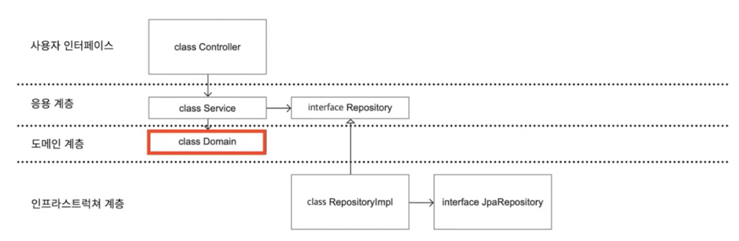
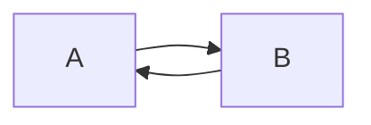
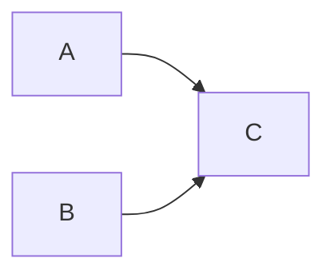
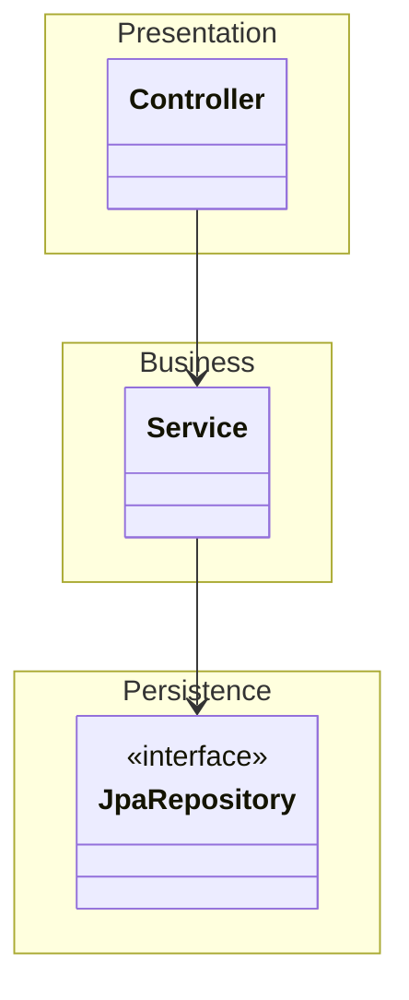
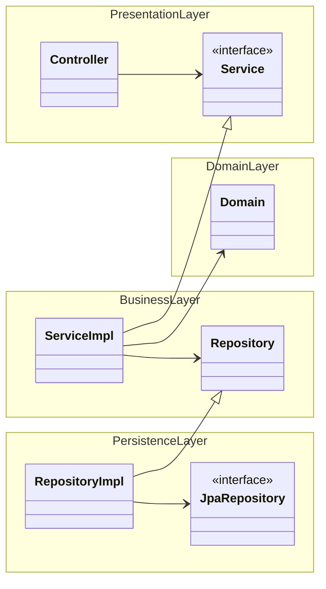

# 아키텍처 관련 개념 정리

## DDD

### DDD란?

- DDD는 Domain driven development가 아님
    - Domain driven design임

### 서비스(애플리케이션) 레이어의 역할

- 소프트웨어가 수행할 작업을 정의하고, 표현력있는 도메인 객체가 문제를 해결하게 함
    - 즉, 문제 해결은 도메인 레이어가 수행한다
- 해당 계층은 최대한 얇게 유지되어야 한다
- 비즈니스 규칙이나 지식이 포함되지 않아야 한다
- **오직 작업을 조정하고, 아래에 위치한 계층에 도메인 객체의 협력자에게 작업을 위임한다**

### 도메인 서비스

- 어느 도메인도 비즈니스 로직을 들고있기 애매한 경우
    - ex: 가격 계산 로직
        - 가격 = 상품의 가격 * 쿠폰의 최대 할인율 - 사용자 마일리지
        - 이럴 경우, 상품, 쿠폰, 사용자 중에서 그 어느 객체도 가격 계산 로직을 들고있기는 애매하다
- **도메인 개념 가운데, 객체로는 모델에 어울리지 않는 것이 있다 - 에릭 에반스**
    - 필요한 도메인 기능을 entity나 value에서 억지로 맡게할 경우, 모델에 기반을 둔 객체의 정의가 왜곡되거나 무의미하고 인위적으로 만들어진 객체가 추가될 것임
- **가격 계산과 같은 애매한 로직은 억지로 하나의 객체에 넣지 말자**
    - **새로운 객체를 만들면 그만이다!**
    - 가격 계산기라는 추가적인 도메인을 만들어서 해결하라
- "가격 계산"과 같이 객체로 표현하기 애매하고, 논리 로직 자체가 목적인 행위자를 **도메인 서비스라고 함**
    - ex: `PriceCalculator`, `PriceManager`, `PriceService`...
- 고민 포인트
    - 도메인 서비스가 유의미한 도메인이 될 수는 없는지를 항상 고민하라
    - ex: `PriceCalculator`는 `Cashier`라는 도메인이 될 수 있다

### 추상화란?

- 복잡한 자료, 모듈, 시스템 등으로부터 핵심적인 개념 또는 기능을 간추려내는 것
- 즉, 모듈을 격리하고 인터페이스로 만들어내는 과정을 의미

### 일단 해두면 좋은 추상화 (추상화는 어디까지..?!)

출처: [Java/Spring 주니어 개발자를 위한 오답노트](https://www.inflearn.com/course/%EC%9E%90%EB%B0%94-%EC%8A%A4%ED%94%84%EB%A7%81-%EC%A3%BC%EB%8B%88%EC%96%B4-%EA%B0%9C%EB%B0%9C%EC%9E%90-%EC%98%A4%EB%8B%B5%EB%85%B8%ED%8A%B8/dashboard)

- 레포지토리 인터페이스를 분리하여 애플리케이션 레이어에 두고, 이를 영속 계층에서 구현하여 사용하도록 아키텍처를 구성
- 영속 계층과 애플리케이션 계층을 분리하므로 DB 구현체, 외부 시스템 연동 등과의 결합도가 낮아진다
- 결과적으로 구현체를 갈아끼우기가 편해지며, 테스트하기 편한 코드가 된다.

### @Service가 도대체 어떤 역할을 하는걸까?

- DDD에서 정의된 서비스를 지칭하는 애노테이션
- 비즈니스 서비스의 Facade
    - 애플리케이션 레이어에서의 `@Service`는 도메인과 도메인 서비스에게 책임을 위임하는 Facade 패턴의 일종으로 볼 수 있음
- 애플리케이션 서비스에 주로 붙인다
    - 애플리케이션 서비스란?
        - Repository에 접근해서 도메인 객체를 가지고 오는 등의 행위를 하며, 도메인/도메인 서비스 객체에게 행동을 위임하는 서비스를 의미

### DDD에서 말하는 서비스

- 자신의 본거지를 Entity, Value object 모두에서 찾지 못하는 중요한 도메인 연산이 있다. (즉, 엔티티나 밸류 오브젝트에 속하기 애매한 도메인 연산을 말함)
    - 이들 중 일부는 본질적으로 사물이 아닌 활동(activity)이나 행동(action)인데 우리의 모델링 패러다임은 객체이므로, 이와 같은 연산들도 객체와 잘 어울리게끔 노력해야 한다.
- 이따금 서비스는 특정 연산을 수행하는 것 이상의 의미는 없는 모델 객체로 가장해서 나타나기도 한다
    - 이같은 행위자(doer)는 이름 끝에 Manager와 같은 것이 붙는다.
- 오늘날 흔히 하는 실수
    - 행위를 적절한 객체로 다듬는 것을 너무나도 쉽게 포기하여, 점점 절차적 프로그래밍에 빠지는 것
    - 즉, 절차 지향적인 코드가 되지 않았는지를 경계하고 객체로 분할해야 함

### 애플리케이션 서비스 vs 도메인 서비스

- 애플리케이션 서비스
    - 스프링 한정) 스프링의 서비스 컴포넌트에 종속되는 서비스 (`@Service`)
- 도메인 서비스
    - 스프링 한정) 스프링의 서비스 컴포넌트에 종속되지 않는 서비스

### DDD에서 중요한 것

- 풍부한 도메인을 만드는 것
- 서비스는 가능한 적게 만들고, 만들더라도 얇게 유지할 것

### 서비스에 관한 팁

- 오브젝트 디자인에서 말하는 서비스
    - 한번 생성하면 특정 작업을 하는 작은 기계처럼 영원히 실행할 수 있어야 함
- 서비스 불변성
    - 생성자 주입만 사용해야 함
    - 서비스는 불변이어야 함. 인스턴스 생성 후에는 변경할 수 없어야 한다.
- 순환 참조는 피할 것
    - 순환 참조는 사실 하나의 컴포넌트라는 의미일수도 있음

아래와 같은 순환 참조 보다는

아래와 같이 컴포넌트를 하나 더 추가하여 해결하는 것이 좋음

## 레이어드 아키텍처
> _원래 설계에서 이상한 일이 일어났을 때, 레이어드 아키텍처를 찍으면 대충 맞는다_
> - 아키텍처에서 무언가 문제가 발생하면, 레이어드 아키텍처 때문인 경우가 대부분임

- 유사한 기능들을 같은 계층으로 묶어 관리하는 방식의 아키텍처 구조
- 의존성 역전이나 추상화 없이 바로 구현체를 사용

### 계정 시스템을 만들어달라는 부탁을 받으면 어떻게 할 것인가?
- JPA 엔티티나 REST API 설계를 먼저 할 것이다 -> 아주 틀린 접근 방식
- **계정 시스템에 필요한 UseCase를 먼저 파악해야 한다**
    - UseCase의 예시
        - 사용자가 회원 가입을 한다
        - 사용자가 이메일을 연동한다
        - 사용자가 정보를 수정한다
    - 이후, 이를 처리하는 도메인들과 도메인들의 관계를 생각하는 게 우선되어야 함!
    - 이렇게 만들어진 도메인에 Spring과 JPA를 얹을 뿐임

### 장점
- 쉽다

### 단점
- 어느 방식으로 접근해도 결과물이 엉망이다 
  - 상향식: JPA에 의존적인 애플리케이션이 되기 쉽다
  - 하향식: 스프링에 의존적인 애플리케이션이 되기 쉽다
  - 즉, 중요하지 않은 것들에 종속되는 결과물이 나온다.
- 동시 작업성이 떨어진다 
  - 어떤 기능을 개발해야 한다 했을 때, 영속성 객체와 Repository가 먼저 나와야 함 
  - 그래서, 어떤 기능을 개발한다 했을 때, 지정된 작업자 한명만 수행이 가능함 
    - 이는 절차지향적인 코드를 짰을 때 발생하는 문제기도 함
- 도메인이 죽는다 
  - 레이어드 아키텍처는 업무 도메인에 대해 아무것도 말해주지 않음 
  - 객체는 수동적이 되고, 모든 코드가 메서드 위주로 돌아가게 됨 
  - 레이어드 아키텍처는 객체에 대해 진지한 고민을 하지 않게 만듦
    - getter, setter 남발 + 수동적인 객체 
  - 트랜잭션 스크립트 방식으로 코드를 작성하게 됨 
  - 사실상, 서비스가 모든걸 처리하는 신과 같은 존재가 되어버림 
- DB 주도 설계를 유도한다
- 의존성에 대한 고민을 유도하지 않는다
- 규모가 커질수록 확장성이 매우 떨어진다
- Testablilty가 낮아지고, SOLID를 위반하게 된다 
 
### 죽은 도메인 살리기 

- Domain layer를 만든다 
- 서비스에 과하게 위임된 책임을 Domain에 전가한다 
- Service는 레포지토리에서 Domain을 가져오고, Domain에게 일을 시키는 역할을 하게 한다 
- 실제 업무 처리는 Domain영역에서 수행한다 
  - 객체들이 협력하는 공간이 된다 
- Domain 레이어는 Mocking이 필요가 없다 
  - 순수 자바 코드 
  - 높은 Testability 
- JpaRepository
  - 굳이 테스트 해야되냐? 
- Service
  - domain, repository와 의존성이 있음 
  - repository 때문에 테스트가 어려워짐 
  - 의존성 역전을 활용하자 (Repository를 인터페이스로 분리, 영속 계층에 이를 구현한 구현체를 만듦)
  - Testability를 높일 수 있음 
- Controller
  - 테스트하는 것이 오히려 자원낭비? 
  - Service 인터페이스를 만든다 
  - 하지만 굳이 추상화를 굳이 안해도 된다 (테스트 안해도 되면)

## 헥사고날 아키텍처

## 클린 아키텍처 