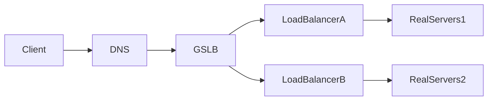
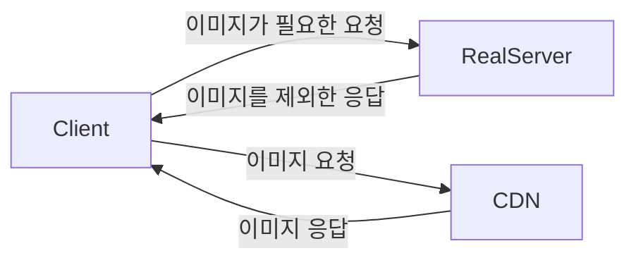

# 네트워크 
## GSLB
- Global Server Load Balancing

- GSLB는 domain을 가짐. Client가 요청 시 DNS는 해당 요청을 GSLB에 보내고, GSLB는 로드 밸런서에 요청을 전달한다.

## 로드밸런싱
### L4 로드밸런싱 
- IP/Port 기반으로 로드밸런싱을 수행 
- L4 계층인 트랜스포트 레이어에서 수행되어 L4 로드밸런싱이라고 함

### L7 로드밸런싱
- URI, Payload, Http header, Cookie 기반으로 로드밸런싱을 수행 
- L7 계층인 애플리케이션 레이어에서 수행되어 L7 로드밸런싱이라고 함 

## 자잘한 개념 
### FQDN
- Fully Qualified Domain Name 
- 서브 도메인을 전부 포함하는 풀네임을 의미 
  - ex: `helloworld.com`은 FQDN이 아님 | `www.helloworld.com`은 FQDN임

### 포트 포워딩 
- 특정 포트로 들어오는 요청을 다른 포트로 변경하여 다시 요청하는 과정 

### DSR 
- Direct Server Return
- 로드밸런서를 거치지 않고 서버에서 클라이언트로 직접 응답을 전달하는 것
- 트래픽 흐름을 조종해서 큰 사이즈의 응답 패킷이 나갈 때, 로드밸런서가 병목 지점이 될 수 있기에 이를 거치지 않고 바로 서버가 클라이언트로 보내게 함 
- 서비스 유형에 따라 사용 여부를 결정하면 됨 
  - 영상, 음성 데이터를 스트리밍하는 경우 응답 속도 이점이 매우 큼
- [참고 자료](https://smashingpumpkins.tistory.com/entry/DSRDirect-Server-Return%EC%9D%B4%EB%9E%80)

### Inline 구성 
- 로드밸런서를 프록시처럼 사용하는 구성 
- [참고 자료](https://run-it.tistory.com/40)

### CDN

- Contents delivery network
- 콘텐츠를 효율적으로 전달하기 위해, 여러 노드를 가진 네트워크에 데이터를 저장하여 제공하는 시스템 
- 이미지와 같은 비교적 큰 파일들을 서버에 직접 요청하지 않고 CDN서버를 통해 가지고오게 할 수 있음
- CDN 서버를 각국에 두어 더 빠르게 이미지를 응답해주도록 구성할 수 있음 
  - ex: 미국에서 한국으로 본 요청을 처리할 때 -> 실제 서버는 한국에서 처리, CDN서버는 미국에 두고 처리  

### ACL
- Access Control List
- 개체나 개체 속성에 적용되어 있는 허가 목록
  - 네트워크 망에 접근을 허가하는 IP 리스트를 의미 
  - 일부 IP, 일부 Port만 허용하고 나머지는 모두 차단하는 등의 작업을 수행할 수 있음 (화이트 리스트 방식으로 관리)
- 사내망에서 외부로 요청을 보낼 때 주로 사용
  - 같은 망 내에서 서로 통신하는 것은 ACL과 관계 X
  - 외부로 나가는 경우 ACL이 허용되어 있어야 함 

### Proxy
- 클라이언트가 자신을 통해 다른 네트워크 서비스에 간접적으로 접속할 수 있게 해주는 컴퓨터 시스템이나 응용 프로그램 
  - 어떤 서버와 통신하기 전에 반드시 거치도록 되어있는 서버 
- 사용하는 이유
  - Cache, AccessControl, 보안, 사용률 파악 등

### SSL
- HTTP + SSL = HTTPS
- 암호화와 인증을 위해 사용되는 프로토콜
- TLS는 SSL의 향상된 버전 
- 인증서 등록
  - CSR(Certificate Signing Request) 
    - 도메인, 이메일 정보, public key 등을 가지고 공인 인증 기관에 인증서 요청 
  - 공인 인증 기관이 확인 후 인증서를 발급 
- SSL 인증 방식
  - 클라이언트가 인증서 요청 
  - 서버가 인증서 전달 
  - 브라우저에 있는 인증 기관의 공개 키로 인증서를 복호화 
  - 인증서의 정보를 확인
  - 인증서의 정보가 신뢰할 수 있는지 확인
  - 클라이언트가 어떠한 키를 만들고, 서버의 공개 키로 암호화
  - 서버에 전달 
  - 서버는 자신의 개인 키로 복호화
  - 대칭 키 방식으로 통신 
