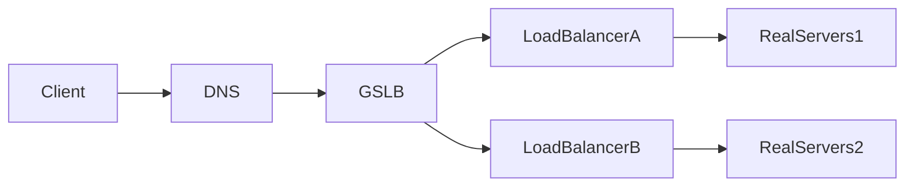

# 네트워크 
## GSLB
- Global Server Load Balancing

- GSLB는 domain을 가짐. Client가 요청 시 DNS는 해당 요청을 GSLB에 보내고, GSLB는 로드 밸런서에 요청을 전달한다.

## 로드밸런싱
### L4 로드밸런싱 
- IP/Port 기반으로 로드밸런싱을 수행 
- L4 계층인 트랜스포트 레이어에서 수행되어 L4 로드밸런싱이라고 함

### L7 로드밸런싱
- URI, Payload, Http header, Cookie 기반으로 로드밸런싱을 수행 
- L7 계층인 애플리케이션 레이어에서 수행되어 L7 로드밸런싱이라고 함 

## 자잘한 개념 
### FQDN
- Fully Qualified Domain Name 
- 서브 도메인을 전부 포함하는 풀네임을 의미 
  - ex: `helloworld.com`은 FQDN이 아님 | `www.helloworld.com`은 FQDN임

### 포트 포워딩 
- 특정 포트로 들어오는 요청을 다른 포트로 변경하여 다시 요청하는 과정 

### DSR 
- Direct Server Return
- 로드밸런서를 거치지 않고 서버에서 클라이언트로 직접 응답을 전달하는 것
- 트래픽 흐름을 조종해서 큰 사이즈의 응답 패킷이 나갈 때, 로드밸런서가 병목 지점이 될 수 있기에 이를 거치지 않고 바로 서버가 클라이언트로 보내게 함 
- 서비스 유형에 따라 사용 여부를 결정하면 됨 
  - 영상, 음성 데이터를 스트리밍하는 경우 응답 속도 이점이 매우 큼
- [참고 자료](https://smashingpumpkins.tistory.com/entry/DSRDirect-Server-Return%EC%9D%B4%EB%9E%80)

### Inline 구성 
- 로드밸런서를 프록시처럼 사용하는 구성 
- [참고 자료](https://run-it.tistory.com/40)
