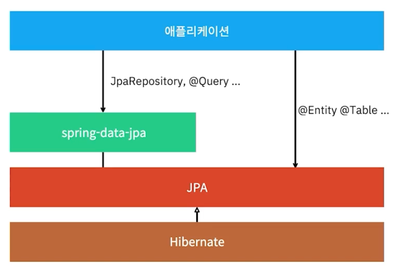
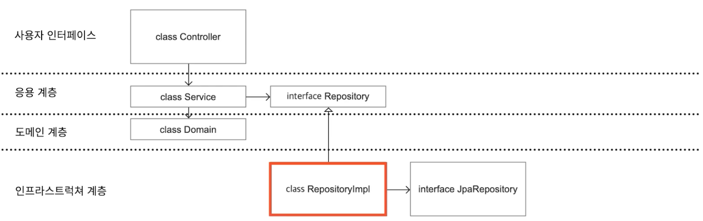

# 스프링 관련 조언 
> 출처: [Java/Spring 주니어 개발자를 위한 오답노트](https://www.inflearn.com/course/%EC%9E%90%EB%B0%94-%EC%8A%A4%ED%94%84%EB%A7%81-%EC%A3%BC%EB%8B%88%EC%96%B4-%EA%B0%9C%EB%B0%9C%EC%9E%90-%EC%98%A4%EB%8B%B5%EB%85%B8%ED%8A%B8/dashboard)
## JPA 


### 연관관계의 주인 
- DB에는 없는 말 
  - JPA에서 만든 것 
- 외래키를 사용하는 참조 객체를 의미 
  - 관계를 표현하는 데 있어서 가장 중요한 것은 외래키 (연관관계의 핵심)
  - 그래서 외래키를 가지고 있는 객체를 연관관계의 주인이라고 표현함 

### N+1
- 지연로딩이던 즉시로딩이던 N+1은 발생한다 
- `@EntityGraph`, `fetch join`, `batch fetch size` ... 
- 구조적인 해결 방법도 있다 
  - 
  - 위와 같은 계층에서, `RepositoryImpl`에 A를 가져오는 쿼리를 한번 수행하고, B를 가져오는 쿼리를 한번 더 수행한다 (A:B = N:1의 관계라고 가정)
  - 가져온 데이터를 조합해서 domain으로 변환하고 반환하면 됨

### `JpaRepository`에 입력된 타입과 리턴 값이 일치하는 것이 좋음 
- `JpaRepository<T, ID>`일 때, `T` 타입만 반환하도록 구성하자 

### `Optimistic Lock` vs `Pessimistic Lock`
- Optimistic Lock 
  - JPA 엔티티에 version 필드를 추가해서 엔티티를 변경하는 방식
  - 실제로 락을 사용하는 것은 아님. 충돌 방지에 가까움. 
- Pessimistic Lock
  - DB에서 제공하는 `for update` 키워드를 이용하여 락을 거는 방식

## 기타 
### 네이밍 컨벤션
- CQRS를 적용하는 곳에선 `Repository` 대신 `Reader`, `Writer`를 사용한다 
  - Read, Write용 객체를 따로 만들기도 한다 

### Proxy self-invocation 문제 조심 
- `@Transactional`과 같은 AOP 애노테이션을 사용하는 메서드를 자가 호출하면 발생하는 문제
- 스프링 컴포넌트에 있는 AOP anootation은 스프링 프록시를 거칠 수 있을 때만 가능함

```java

@Service
public class MyService {
  public void doSomething1() {
    doSomething2();  // 여기서 호출해봐야 
  }

  @Transactional  // 트랜잭션을 타지 않는다 
  public void doSomething2() {
      // 대충 트랜잭션 타는 로직 
  }
}
```
- AOP 애노테이션은 스프링 프록시를 통해서 호출되어야만 적용된다. 
  - 메서드를 자가 호출할 경우, 스프링 프록시를 통한 호출이 아니므로 적용되지 않는다.  


### `LocalRepository(Fake)`
- 개발 시 별도의 DB를 띄우지 않아도 됨 (`local`, `test`환경에 적용)
- 테스트 실행 속도가 빠름 
  - h2와 같은 DB 환경을 별도로 띄우지 않아도 되기 떄문 
  - h2와 같은 간이 서비스가 없는 DB 레이어도 테스트 가능 (ex: ElasticSearch, MongoDB...)
- 실행 환경과 같다는 것을 보장할 수 없음 
- `LocalRepositoryImpl` 또한 구현해줘야 하므로 일이 많아짐

```java
@Profile({"local", "test"})
@Repository
class LocalUserRepositoryImpl implements UserRepository {
  private int incrementId = 1;
  private final List<User> users = new ArrayList<>();
  
  // 나머지 로직 구현... 
}
```