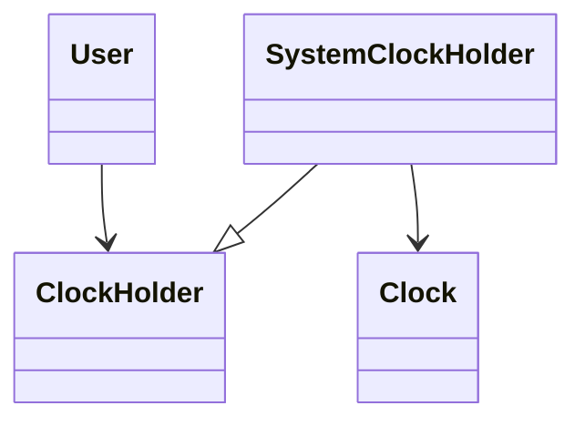
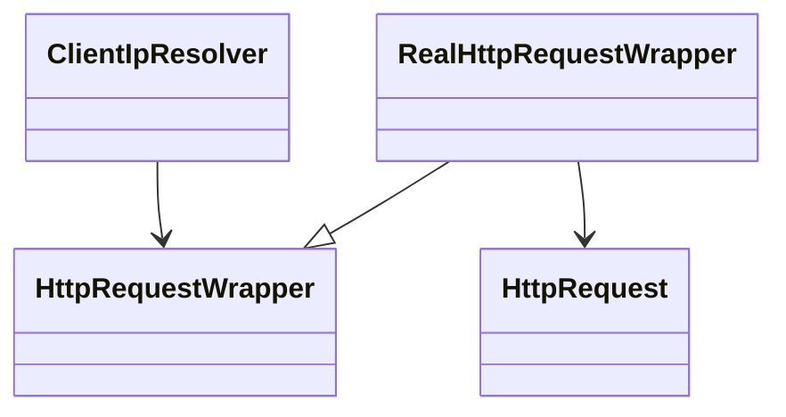
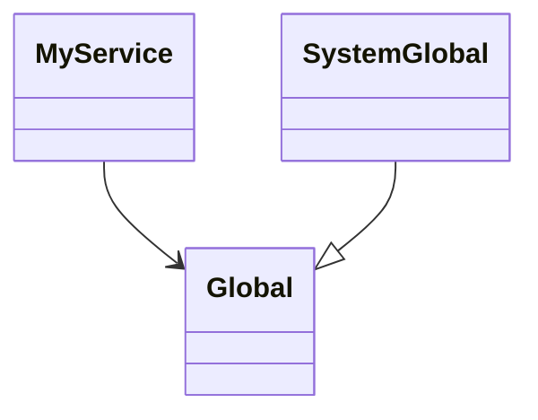

# Test 관련 내용 정리
## 테스트 코드가 없으면...
- 불안에 떨며 릴리즈
- 긴 릴리즈 주기 
- 생산성 저하 

## 테스트 코드 장점 
- 자신감 있게 릴리즈 가능  
- 생산성 향상
- 좋은 아키텍처 유도 (테스트 하기 좋은 코드)
  - SOLID한 코드가 좋은 설계일 확률이 높다  
  - Test와 SOLID는 긴밀한 상관 관계를 가진다 (상호 보완적)
- 회귀 버그를 방지 
- 테스트를 명료하게 작성하도록 노력하면, 단일 책임 원칙이 지켜질 확률이 높다 
  - 테스트 클래스에 테스트가 많아지면.. 목적이 눈에 안들어옴 → 클래스 책임이 과하다는 신호 → 클래스 분할 
- 테스트를 작성하다 보면, 개방 폐쇄 원칙을 지키게끔 코드를 작성할 수밖에 없다
  - 테스트 작성을 위해서는 테스트용 컴포넌트와 프로덕션용 컴포넌트를 나눠서 작성 → 선택적으로 탈부착이 가능해야함  
  - 자연스럽게 개방 폐쇄 원칙을 지키게 됨 
- 리스코프 치환 원칙을 지키는지도 확인 해줌 
  - 이상적으로 테스트는 모든 케이스에 대해 커버하기 때문 
- 테스트는 그 자체로 인터페이스를 사용할 수 있는 환경 
  - 불필요한 의존성을 실제로 확인할 수 있는 샌드박스 
  - "인터페이스가 너무 많아서, 뭘 호출해야할지 모르겠는디?" → 인터페이스를 분리해줘야 하는 시점
- 테스트는 의존성 역전 원칙을 지키게 유도해준다 
  - 가짜 객체를 이용하여 테스트하려면, 의존성이 역전되어 있어야 하는 경우가 생기기 때문 (Fake, Dummy...)

## Regression
- 잘 돌아가던 코드가 배포로 인해 동작하지 않는 상황

### 회귀 버그
- 서비스를 제공하지 못하던 상황으로 회귀하는 상황 

### 회귀 테스트
- 서비스에 회귀 버그가 있는지를 확인하는 테스트

## 인수/자동 테스트 
### 인수 테스트
- 인수 검사란?
  - 정보 시스템 검사 중 하나. 
  - 시스템이 실제 운영 환경에서 사용할 준비가 되었는지 최종적으로 확인하는 단계 
  - 시스템 검사는 사용자가 평가하고 관리자가 점검

### 자동 테스트 
- 소프트웨어를 이용하여 자동화된 테스트 

---

## 테스트의 3분류 
### API 테스트 (E2E)
- 멀티 서버
- End to end 테스트 
- 테스트 결과가 상대적으로 불안정함 
  - 예상치 못한 이유로 실패할 수 있음  

### 통합 테스트
- 단일 서버
- 멀티 프로세스 
- 멀티 스레드 
- 테스트용 DB를 사용할 수 있음
  - H2와 같은 DB를 사용할 수 있음 
- 단위 테스트보다 느리고, 멀티 스레드 환경에서 어떻게 동작할지 알 수 없기 때문에 테스트가 결정적이지 않아 결과가 보장되지 않음
  - H2와 같은 외부 모듈의 동작에 따라 달라지기 때문 

### 단위 테스트 
- 단일 서버 
- 단일 프로세스
- 단일 스레드 
- 디스크 I/O를 사용하지 않음
- Blocking call을 허용하지 않음 
- 테스트가 항상 결정적이고 빠름
  - 이런 테스트를 여러개 만들어서 코드 커버리지를 높이자 
  - 단위 테스트를 늘릴 수 있는 환경을 만들고, 늘려야 한다 

## 테스트 관련 용어 
### SUT
- System under the test (테스트 하려는 대상)

### TDD
- 테스트 주도 개발 
- 방법
  1. 깨지는 테스트를 먼저 작성한다
  2. 깨지는 테스트를 성공시킨다
  3. 리팩토링한다

### BDD
- Behaviour driven development (given-when-then)
- 시나리오에 기반한 테스트를 수행하는 방식 
  - 어떤 상황이 주어지고, 어떤 행동을 할 때, 이렇게 되더라 

### 불규칙한 테스트 (flaky)
- 대상 코드에 아무런 변경이 없음에도 불구하고 실패하는 테스트

### 깨지기 쉬운 테스트 (brittle)
- 실제로는 버그가 없음에도, 심지어 검증 대상 코드와 관련조차 없는 변경 때문에 실패하는 테스트 
- 테스트에 필요한 가정들이 명시적으로 작성되어있지 않을 경우 발생

### 상호 작용 테스트 (interaction test)
- 대상 함수의 구현을 호출하지 않으면서, 그 함수가 어떻게 호출되는지를 검증하는 기법
- 일반적으로 상태를 테스트하는 것이 더 좋은 방법

### 테스트 더블 
- Test double = 테스트 대역 
- 가짜 객체를 의미 

### Dummy  
- 아무런 동작도 하지 않고, 그저 코드가 정상적으로 돌아가기 위해 전달하는 객체 

### Fake  
- Local에서 사용하거나 테스트에서 사용하기 위해 만들어진 가짜 객체
- 자체적인 로직이 있다는 것이 특징 

### Stub
- 미리 준비된 값을 출력하는 객체 
- 주로 외부 연동하는 컴포넌트들에 많이 사용 
- Mockito 프레임워크 이용 

### Mock
- 메소드 호출을 확인하기 위한 객체
- 자가 검증 능력을 갖춤 
- 사실상 테스트 더블과 동일한 의미 

### Spy
- 메소드 호출을 전부 기록했다가 나중에 확인하기 위한 객체 

### Mock 프레임워크 
- 가능하면 사용은 지양하는게 좋음 
- UserRepository를 인터페이스로 구현한 경우
  - UserRepository가 굳이 인터페이스여야 할 이유가 있나? 그냥 class로 만들고 mock 프레임워크를 사용해서 필요할 때마다 stub하면 되지 않나?
  - 이러한 유혹에 빠지면 안됨 
  - 테스트 코드를 작성하는 것 자체가 목적이 되어버림 -> **자연스러운 추상화를 통한 유연한 설계를 얻을 기회**를 놓치게 됨
- 테스트 코드의 목적을 잊지 말자  
  - 회귀 버그 방지
  - 유연한 설계 

---

## 조언 
### private 메소드는 테스트해야 하나?
- NO
- private 메소드를 테스트하고 싶은 느낌이 들 때...
  - 사실 private 메소드가 아니었어야 한다는 의미일수도 
  - 해당 메서드를 다른 클래스로 분리하고, 책임을 위임해서 public으로 만들라는 의미일수도
- 이는 메소드 지향의 테스트를 할 때 자주 발생하는 문제이다
- 테스트는 **행위에 집중해서**테스트를 하자 

### final 메소드를 stub해야 하는 상황이 발생한 경우 
- 무언가 설계가 잘못된 것 
- final 메소드에 걸린 의존성을 약하게 하는 방법을 생각해야 함 

### DRY < DAMP
- 테스트 코드는 DRY 보다는 DAMP!
  - DRY: Don't Repeat Yourself (반복하지 않기)
  - DAMP: Descriptive And Meaningful Phrase (서술적이고 의미있는 문구)
- 테스트할 때 만큼은 중복을 줄이는 것 보다는 테스트 하나하나마다 독립적이고, 서술적이며 의미있는 코드를 작성하는 것이 낫다  

### 논리
- 테스트에 논리를 넣지 말자 
  - for/if/사칙연산 등을 넣지 말자는 의미
- 테스트 코드가 오래, 그리고 많이 실행되려면 직관적이고 바로 이해가 가능하게 짜는 것이 좋다 

---

## 기법 
### 의존성 추상화 
- 테스트하기 어려운 의존성이 있을 때 사용 가능한 기법 
- 다루기가 까다로운 경우(Random, Time...) 

- 테스트에 필요한 인스턴스를 생성하기 힘든 경우 (HttpRequest...)

- 재정의가 까다로운 경우 (final, 전역 참조...)

### 이벤트 기록 
- 테스트를 위한 getter 생성이 남발된다 싶을 때 
- 호출된 메서드의 이벤트를 기록 
