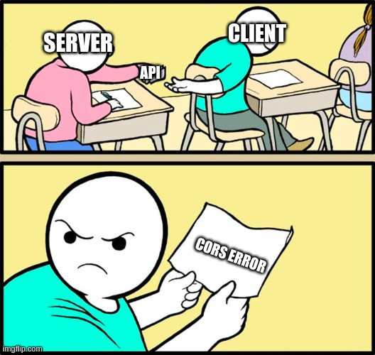
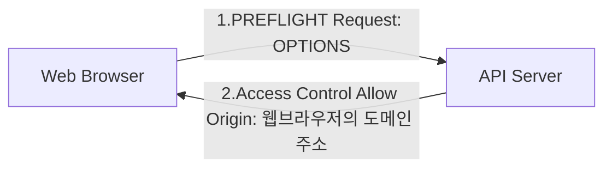
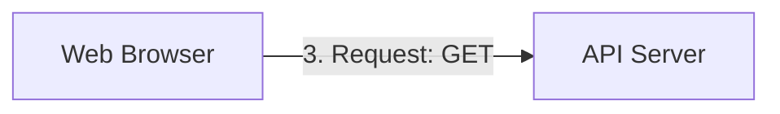
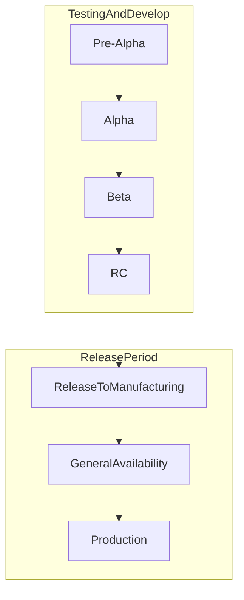

# 개발 용어 정리
## REST API
- 로이 필딩의 논문에 아래와 같이 소개되어 있음 
  - Uniformb (일관성)
  - Stateless (무상태성)
  - Cacheable (캐시 가능)
  - Self-descriptiveness (인터페이스만 봐도 이해 가능)
  - Client-Server
  - 계층형 구조 

### 형태
```text
GET /users
POST /users
GET /users/{id}
PUT /users/{id}
DELETE /users/{id}
```
- Http Method로 행위를 표현
  - GET, POST, PUT, DELETE..
- URI로 자원을 표현
  - /users, /users/{id}..
  - 복수형으로 사용하자 
  - 끝에 / 를 붙이지 말자 
  - PUT, PATCH는 구분해서 사용하자 
    - PUT은 전체 리소스를 업데이트할 때 사용 (멱등성 보장)
    - PATCH는 부분 리소스를 업데이트할 때 사용 (멱등성 보장 X)
  - 검색은 GET + 쿼리 스트링으로 하는게 좋으나...
    - POST도 사용하기는 한다... 
  - path에 동사를 사용하지말자. 행위는 반드시 HTTP Method로 표현한다.
- 응답 코드를 신경쓰자 


## OAuth
- Open Authorization
- 인터넷 사용자들이 비밀번호를 제공하지 않고 다른 웹사이트 상의 자신들의 정보에 대해 웹사이트나 애플리케이션의 접근 권한을 부여할 수 있는 공통적인 수단
  - 접근 위임을 위한 개방형 표준 
  - ex: Google login, Naver login...
- 왜 쓸까?
  - 사용자 입장에서, 신뢰할 수 있는 사이트에만 가입하고 싶을 수 있음
  - 가입이 매우 편함 

## 인증 vs 인가
- 인증
  - 사용자가 누구인지 확인하는 과정
  - 없으면 401 Unauthorized (토큰이 유효하지 않을 때)
- 인가
  - 사용자가 특정 자원에 접근할 수 있는 권한이 있는지 확인하는 과정
  - 없으면 403 Forbidden (토큰이 접근 권한이 없을 때)


## SSO
- Single Sign On
- 로그인 한번으로 여러 서비스를 이용할 수 있으면 SSO를 지원하는 것 
- 네이버 페이 로그인 -> 네이버 로그인을 사용하고 있는 다른 서비스에서도 자연스럽게 로그인 처리가 되어있으면 SSO를 지원하는 것 


## 불변성
- 변하지 않는 성질 
  - Value Object, 불변 객체, Immutable
  - 순수 함수
- 불변성을 지키면 얻을 수 있는 이점
  - Thread-safe
  - 복사본을 만들지 않고 공유할 수 있음 
  - 불변 객체는 자유롭게 공유 
- 설계를 단순화 시킬 수 있는 핵심 요소임 


## 함수형 프로그래밍
- 자료 처리를 수학적 함수의 계산으로 취급하고, 가변 데이터를 멀리하는 프로그래밍 패러다임
- 사이드이펙트가 없는 immutable, pure function을 지향 


## 사이드이펙트
- 함수를 수행할 때 발생할 수 있는 명시적인 입출력 값 외 모든 암묵적 입출력을 의미 
  - 예상 값 이외의 결과들 
- 함수의 인터페이스 상에 눈에 보이는 입출력(명시적)
  - 명시적 입력 : 매개변수
  - 명시적 출력 : 반환값
- 함수의 인터페이스 상에 눈에 보이지 않는 입출력(암묵적) 
  - 암묵적 입력 : 전역 변수, 참조하는 객체의 필드 등 매개변수 외의 다른 입력값 
  - 암묵적 출력 : 전역 변수 수정, API 호출 등 반환값 외의 다른 출력값


## 라이브러리 vs 프레임워크 
- 프로그램의 주도권을 누가 갖고 있느냐의 차이 
  - 컴포넌트 생성, 호출의 주체가 누구인가?
  - IoC Container가 있는가? 
  - Container를 알아서 관리해주는 라이브러리 == 프레임워크
- 라이브러리?
  - 펀치홀로 코딩할 때 도서관에 저장해서 라이브러리라고함


## CORS

- Cross Origin Resource Sharing
- 아무데서나 내 서버를 함부로 호출하지 못하게 하는 정책 
  - 웹 백엔드를 보호해주는 소중한 정책
- API 서버가 지정한 도메인에서만 통신할 수 있도록 함
- 브라우저단에서 동작 -> `curl`이나 `postman`을 이용한 요청은 CORS 검증을 하지 않음 


- 위 과정에서 CORS 허용이 되어야만 비로소 API 서버에 요청을 보낼 수 있음 



## XSS 
- Cross Site Scripting
- 웹 애플리케이션에서 많이 발생하는 취약점 중 하나
- 악의적인 사용자가 스크립트를 삽입하여 공격하는 기법


## 멱등성 
- Idempotence
- 연산을 여러 번 적용하더라도 결과가 달라지지 않는 성질


## 공변성
- Covariant
- 공변성
  - 서브 타입이 수퍼 타입 대신 사용될 수 있는 성질
- 반공변성
  - 슈퍼 타입이 서브 타입 대신 사용될 수 있는 성질
- 무공변성 
  - 서브 타입과 슈퍼 타입이 서로 대체될 수 없는 성질

```java
interface Message {
    String print();
}
class PostItMessage implements Message {
    private String message;
    
    @Override
    public String print() {
        return message;
    }
}

interface Super {
    Message createNewMessage();
    PostItMessage createNewPostItMessage();
    void printMessage(Message message);
    void printPostItMessage(PostItMessage message);
}

class Sub implements Super {
    // 오버라이딩 성공
    // Java는 리턴 타입에 대해 공변성을 지원한다 
    @Override
    public PostItMessage createNewMessage() {
        return new PostItMessage();
    }
    
    // 오버라이딩 실패
    // Java는 리턴 타입에 대해 반공변성을 지원하지 않는다 
    @Override
    public Message createNewPostItMessage() {
        return new PostItMessage();
    }
    
    // 오버라이딩 실패
    // Java는 파라미터 공변성을 지원하지 않는다 
    @Override
    public void printMessage(PostItMessage postItMessage) {
        System.out.println(postItMessage.print());
    }
    
    // 오버라이딩 실패
    // Java는 파라미터 반공변성을 지원하지 않는다 
    @Override
    public void printPostItMessage(Message message) {
        System.out.println(message.print());
    }
}
```

## 패키지 매니저 
- 개발 환경을 도와주는 관리자 
- OS 별 패키지 매니저
  - ubuntu: apt-get
  - centos: yum
  - redhat: rpm
  - mac: brew
- 언어 별 패키지 매니저
  - java: maven, gradle
  - nodejs: npm, yarn
  - python: pip
  - ruby: gem
- 패키지 매니저들은 중앙 저장소를 갖고 있음 
  - 중앙 저장소에서 가져와서 사용하는 것 


## 리눅스 기본 커맨드 
```shell
# 파일 내용 출력 
cat 

# 단어 검색
grep 

# 파일이나 텍스트 통계 정보
# 줄 수, 단어 수, 바이트 수 를 출력함  
wc  

# 줄 수만 출력하기
wc -l

# 파일의 마지막 부분 출력 (default=10 lines) 
tail 

# 마지막 첫 줄만 출력 
tail -1

# CPU 전체 정보
cat /proc/cpuinfo

# CPU 코어 개수 
cat /proc/cpuinfo | grep 'processor' | wc -l

# CPU 코어 모델 
cat /proc/cpuinfo | grep 'model' | tail -1 

# MEM 전체 정보 
cat /proc/meminfo | grep 'MemTotal'

# MEM 이용 정보
free

# 하드 용량 (disk free human-readable)
df -h

# 하드 사용량 (disk usage)
du -h 

# OS 정보 
cat /etc/*-release | uniq

# 서버 모니터링 
top 

# 로그 테일링: 실시간으로 파일을 모니터링하는 기능 
tail -f /{로그파일명}
```


## 엔티티 
- 도메인 엔티티와 DB 엔티티는 다르다 
  - 도메인 모델에 대한 이해가 쌓이면, 실제 도메인 모델의 엔티티와 DB 관계형 모델의 엔티티는 같은 것이 아님을 알게될 수 있다. 
- 아래의 개념을 구분하는 것은 중요하다
  - 도메인 엔티티
  - DB 엔티티
  - 영속성 객체

### 도메인 엔티티
> 비즈니스 영역을 해결하기 위한 모델 
- 소프트웨어에서 어떤 도메인이나 문제를 해결하기 위해 만들어진 모델 
- 비즈니스 로직을 들고 있고, 식별이 가능하며, 생명 주기를 가짐 
- 도메인 객체랑 비슷하나, 좀 더 비즈니스에 초점이 맞춰진 객체임
- 도메인에 `@Entity`를 붙이는 순간 우리의 비즈니스 도메인은 RDB에 종속된다
  - `@Entity`를 도메인으로써 사용하다가, MongoDB로 변경하게 되면? 
  - `@Document`로 붙여야 하는데.. 심지어 의존성도 바꿔줘야 한다(`spring-data-jpa` -> `spring-data-mongodb`)
    - ODM, Document DB는 Jpa를 따르지 않음 
  - 인프라 레이어가 우리의 도메인에 영향을 주지 못하게 설계하기 위해서는 격리해야 한다. (의존 역전 필요)

### 영속성 객체
> RDB에 있는 엔티티를 매핑해주는 객체 
- ORM(Object Relational Mapping)
- JPA + Hibernate

### DB 엔티티 
> RDB에 저장되는 객체 
- 데이터베이스에 표현하려고 하는 유형, 무형의 객체로써 서로 구별되는 것을 뜻함

### 도메인 엔티티와 DB 엔티티의 패러다임이 다르다
- 도메인 엔티티와 DB 엔티티를 맵핑해주는 역할만 전담하는 다른 엔티티가 필요
- 이를 도와주는 것이 영속성 객체고, Jpa(+Hibernate)라고 볼 수 있음 


## 명령형 vs 선언형
### 명령형(Imperative)
- How에 집중하는 방식
  - 프로그램한테 "이렇게 이렇게 해라"하고 명령하는 것. 절차 지향에 가까운 개념. 
- 프로그래밍의 상태와, 상태를 변경시키는 구문의 관점에서 "연산"을 설명하는 프로그래밍 패러다임의 일종 
- 즉, 컴퓨터가 수행할 명령들을 **순서대로 써놓은 것**을 말함
- ex: github actions workflow (각 job이 뭘 해야 하는지를 명령함)

### 선언형(Declarative)
- What에 집중하는 방식 
- 프로그램이 어떤 방법으로 해야하는지를 나타내기 보다, **무엇과 같은지를 설명하는 경우**에 선언형이라고 함 
- 즉, **목표를 명시하고, 알고리즘을 명시하지 않는 것**을 말함 
  - 방법은 신경쓰지 않음 
- ex: 쿠버네티스 스펙 (각 서버를 어떤 스펙으로 몇 대를 유지해야 하는지를 선언함)


## 프론트 용어 
- 모달(modal)
- 토스트(Toast)
- 글로벌 네비게이션 바(GNB)
- 로컬 네비게이션 바(LNB) : GNB의 특정 메뉴를 클릭해서 나오는 서브 메뉴 
- Og tag : 웹 페이지가 소셜 미디어에 공유될 때, 미리보기로 나오는 정보 (제목, 설명을 알아서 추출)


## release candidate(RC) - gamma or delta 

- 출시 후보 (배포하기 바로 직전)
- 마지막 제품이 될 가능성이 있는 시험판(beta)
  - 상당한 버그가 나타나지 않을 경우 출시할 준비가 되어씨음을 의미 
- 프리뷰 릴리즈 버전으로도 불림 
- GA(GeneralAvailability)의 경우, 범용적으로 사용 가능하다는 의미 