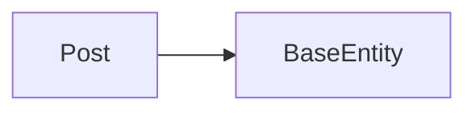
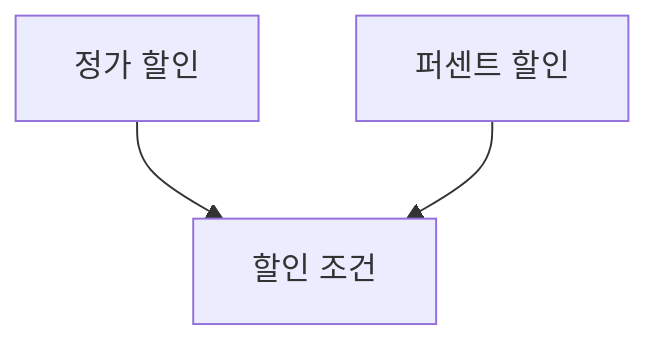

## 상속 관련 QueryDSL 삽질 기록



- 상황 1 : 위와 같은 상속 관계를 가진 상황에서, `BaseEntity`는 “생성 시간”필드와 “수정 시간”필드를 가지고 있다.

```java
public Page<Post> pagedPosts(Pageable pageable) {
        List<Post> postResponses = queryFactory.select(post)
                .from(post)
                .orderBy(post.id.desc())
                .offset(pageable.getOffset())
                .limit(pageable.getPageSize())
                .fetch();

        JPAQuery<Long> countQuery = queryFactory.select(post.count())
                .from(post);

        return PageableExecutionUtils.getPage(postResponses, pageable, countQuery::fetchOne);
    }
```

- 상황 2 : 페이징을 할 때 생성 시간을 기준으로 내림차순 하고 싶었다. 하지만, 부모 클래스 필드에 QueryDsl로 접근하는 방법을 몰랐다.
    - 삽질 1 : QClass가 상속관계로 생기기 때문에 지원을 안해주는 걸까? → 관련 내용을 검색했지만 이렇다 할 소득을 얻지 못함
    - 삽질 2 : QBaseEntity가 생성된것을 확인하고 orderBy구에 `QBaseEntity.createdAt.desc()`를 넣어봄. 역시 안됨. 당연한 결과.

- 멍청한 결론 : 아 지원을 안하는걸까? `Projection`이라는 기능을 사용해서 DTO에 매핑 후, 그걸 기준으로 정렬을 해야하나..? 라는 생각을 함

아무래도 내가 뭘 모르는 것 같다는 판단이 들어, 현업자분께 위의 멍청한 질문을 드렸다. 어우.. 잔소리 하나도 없이 흔쾌히 대답해주신 노가다님께 무한 감사를 …

아래의 방법으로 해결할 수 있다. 


- QClass에는 부모 클래스에 대한 참조를 제공하기 위해 `_super`라는 변수를 제공한다.

저걸 쓰면 부모 필드에 접근할 수 있다.. 대체 난 무엇을 공부한 것일까 ㅠ 오늘도 제대로 공부 안했음을 몇번이나 깨닫는 건지.. 정말 제대로 공부하는 것이란 너무 어려운 것 같다. 이렇게 부딪혀가며 깨닫는 것도 좋겠지만, 기본은 해야한다는 생각이 항상 있는데도 불구하고, 놓치는게 너무 많은 것 같아서 아쉽다.

```java
public Page<Post> pagedPosts(Pageable pageable) {
        List<Post> postResponses = queryFactory.select(post)
                .from(post)
                .orderBy(post._super.createdAt.desc())
                .offset(pageable.getOffset())
                .limit(pageable.getPageSize())
                .fetch();

        JPAQuery<Long> countQuery = queryFactory.select(post.count())
                .from(post);

        return PageableExecutionUtils.getPage(postResponses, pageable, countQuery::fetchOne);
    }
```

## 하지만 덕분에, 하나의 귀한 인사이트를 얻을 수 있었다.

객체지향에서 “상속”이란, 같은 타입끼리 묶기 위해 사용되어야 한다고 한다. 즉, 서로 대체가 가능한 객체들일 때 상속으로 묶어 다형성을 사용할 수 있음을 의미한다.

예를 들어, 아래의 상속 관계가 있다고 가정해보자. (해당 예시는 조영호님의 오브젝트를 참고했다)



할인 조건에 정가 할인과 퍼센트 할인 조건이 있다. “무언가를 할인 해주는 조건”이기 때문에, 둘의 역할은 동일하다. 즉, 어떠한 로직이 있을 때, 정가 할인과 퍼센트 할인이 뒤바뀌어도 전혀 문제 없이 코드가 돌아갈 것이다.

위와 같이 “역할이 동일한 것들”끼리 묶기 위해 사용되는 것이 “상속”이다. 

> 조영호님은 클래스 상속은 캡슐화를 깨기 때문에, 인터페이스 상속을 권장하고 있다. 또한, 아직 해당 내용에 대해 깊게 이해는 하지 못해서, 다 읽은 후에 한번 더 읽어봐야 할 것 같다.
> 

하지만, `BaseEntity`는 단순히 **중복을 제거**하기 위해 만들었다. 이는 상속을 올바르게 사용하지 않은 케이스라고 볼 수 있겠다. 이유는 다음과 같다.

- 모든 엔티티가 공유하도록 만든 클래스로써, `Post`, `Member`, `Comments`...등 다양한 엔티티들이 사용할 예정이었다.
- 이들은 서로 **대체될 수 없다**
- 때문에, 상속을 **올바르게 사용하지 않았다**라고 할 수 있겠다.

이에 따라, 아래와 같은 고민이 생겼다. 

- 상속 대신 **값 객체** 도입을 고려해본다.
    - 하지만 이가 JpaAuditing이 되는지 모르겠다.
        - 찾아보니까 엔티티리스너는 Entity 혹은 그 상위 클래스에만 적용될 수 있다고 한다.
    - 되지 않는다면, `LocalDateTime.now()`를 통해 생성 시점에 직접 만들어주면 좋을 것 같다.
        - 생각해보니 이렇게 하면 update를 할 때도 LocalDateTime을 수정해줘야 한다. 그냥 엔티티에 수기입 하는 쪽으로…
    - 값 객체가 올바르게 동작되지 않는다면, 일단은 필드에 모두 수기입을 해 줄 계획이다.
        - 그런데, 이 방법을 사용할 경우, 업데이트 시 누군가 시간 기입 필드를 빼먹는다면..? 수정 요청이 들어왔을 때 자체적으로 수정을 할 수 있도록 해야할까?
- 엔티티에 `@JpaAuditing`을 사용한다
    - 엔티티가 너무 뚱뚱해지는게 아닐까? 역할/책임이 너무 과중되는게 아닐까? 객체지향 관련 생각은 정말 어려운것같다.

## 하지만 BaseEntity의 편리함도 있을텐데…

- BaseEntity를 사용하는 경우 : Jpa가 대신 해줘서 편리함 + 누락될 가능성이 없음
    - 객체 지향적이지 못하다
- BaseEntity를 사용하지 않는 경우
    - 직접 업데이트 해주는 경우 : 누락될 가능성 o
    - 엔티티에 직접 `@JpaAuditing`을 달아주는 경우 : 엔티티에 너무 많은 것이 달리는게 아닐지.. 괜찮은가? 역할은 어차피 EntityListener가 해주는거니까 엔티티에 책임이 몰리는건 아닌걸까..?

쉽사리 결정을 내리지 못하겠다. 이것도 해보고 저것도 해보는 게 답이거나, 다른 스터디원분들과 토론해보면 좋은 주제인 듯 하다. 다음주에 토론 주제로 들고가야겠다. 

## 마무리

엄청난 삽질과 엄청나게 멍청한 결론을 내려본 경험이었다. 앞으로는 이러지 않기 위해서, 공식문서를 참고하자.. 아님 클래스 파일을 제대로 보던가..
